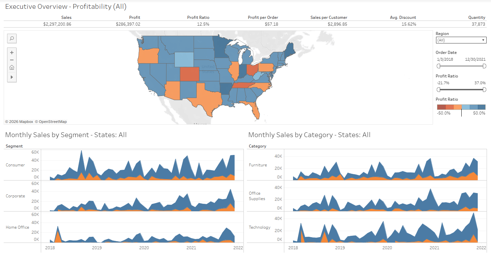
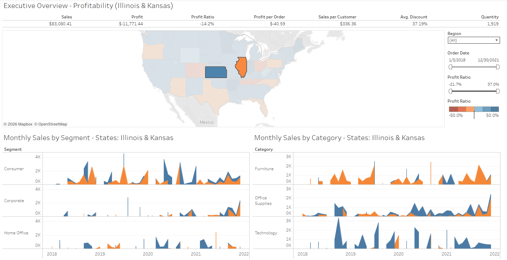

# 📊 Tableau Dashboard Project

## 🔹 Project Overview
This project is part of my learning roadmap in Data Analytics. The goal is to build interactive Tableau dashboards that visualize key insights from real-world datasets, demonstrating data connection, preparation, interactive features, and storytelling.

---

## 🔹 Dashboards

### 1. Executive Overview Dashboard
This dashboard provides a high-level summary of the Superstore dataset.

- **Features**:
  - 📈 **Sales Trends**: Line chart showing sales over time.
  - 🗺️ **Regional Performance**: Map illustrating performance by region.
  - 📊 **Category Breakdown**: Bar chart showing sales by product category.
  - 🔍 **Interactive Filters**: Filter by region, category, or date range.
- **View Live**: [Tableau Public](https://public.tableau.com/app/profile/osandamadugalle/viz/ExecutiveOverview_17677857746820/ExecutiveOverview)
- **Source Data**: [Sample - Superstore.xls](Executive%20Overview%20Dashboard/Sample%20-%20Superstore.xls)
- **Tableau File**: [Executive Overview.twb](Executive%20Overview%20Dashboard/Executive%20Overview.twb)

### 2. Convenience Store Dashboard
This dashboard was created to practice and explore data relationships in Tableau.

- **View File**: [Convenience Store.twbx](Convenience%20Store/Convenience%20Store.twbx)
- **Source Data**: [convenience_store.xlsx](Convenience%20Store/convenience_store.xlsx)

---

## 🔹 Development Process

### Learning & Development
- The dashboards were built by following tutorials and guides from the official [Tableau Training](https://www.tableau.com/learn/training) website.

### Data Preparation
Data cleaning for the datasets was performed in MS Excel.

- **Dataset A**:
  - **Tutorial Followed**: [Data Cleaning in Excel (Video 1)](https://youtu.be/H0tRB7M4VI8?si=5B0FWTFSWMNNdu0n)
  - **Files**: [Before Cleaning](Data%20Clean%20-%20MS%20EXCEL/A%20-%20Before%20Clean.xlsx) | [After Cleaning](Data%20Clean%20-%20MS%20EXCEL/A%20-%20After%20Clean.xlsx)
- **Dataset B**:
  - **Tutorial Followed**: [Data Cleaning in Excel (Video 2)](https://youtu.be/jxq4-KSB_OA?si=IOdUZCtim_eyiqt8)
  - **File**: [B - Data Set.xlsx](Data%20Clean%20-%20MS%20EXCEL/B%20-%20Data%20Set.xlsx)

---

## 🔹 License
This project is licensed under the MIT License - see the [LICENSE](LICENSE) file for details.

## 🔹 Author
Created by **Osanda Madugalle**  
🌐 [osandamadugalle.me](https://osandamadugalle.me)